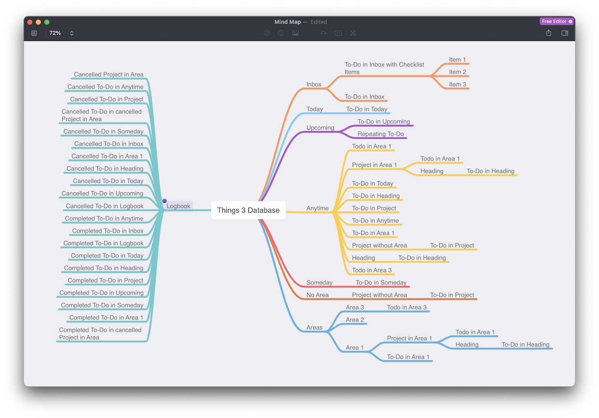

# Things Python CLI

A simple Python 3 CLI to read your [Things app](https://culturedcode.com/things) data using the [things.py API](https://github.com/thingsapi/things.py/).

[](https://github.com/thingsapi/things-cli/actions)
[](https://codecov.io/gh/thingsapi/things-cli)
[](https://scrutinizer-ci.com/g/thingsapi/things-cli/?branch=master)
[](https://github.com/thingsapi/things-cli/issues)
[](https://opensource.org/licenses/Apache-2.0)
[](https://github.com/thingsapi/things-cli/releases)
[](https://pypi.org/project/things-cli/)
[](https://github.com/thingsapi/things-cli/releases)

## Table of Contents

- [Install](#install)
- [Examples](#examples)

## Install

```sh
$ pip3 install things-cli
# or
$ git clone https://github.com/thingsapi/things-cli && cd things-cli && make install
```

## Examples

```shell
% things-cli inbox
 -  To-Do in Inbox with Checklist Items  ( Inbox )
 -  To-Do in Inbox  ( Inbox )

% things-cli --recursive areas
- Area 3 ()
  - Todo in Area 3 (Area 3)
- Area 2 ()
- Area 1 ()
  - Project in Area 1 (Area 1)
    - Todo in Area 1 (Project in Area 1)
    - Heading (Project in Area 1)
      - To-Do in Heading (Heading)
  - To-Do in Area 1 (Area 1)

% things-cli --json today|jq
[
  {
    "uuid": "5pUx6PESj3ctFYbgth1PXY",
    "type": "to-do",
    "title": "To-Do in Today",
    "status": "incomplete",
    "notes": "With\nNotes",
    "start": "Anytime",
    "start_date": "2021-03-28",
    "deadline": null,
    "stop_date": null,
    "created": "2021-03-28 21:11:22",
    "modified": "2021-03-28 21:11:30"
  }
]

% things-cli --csv --recursive all > all.csv && open all.csv

% things-cli --opml --recursive all > all.opml && open all.opml
```


